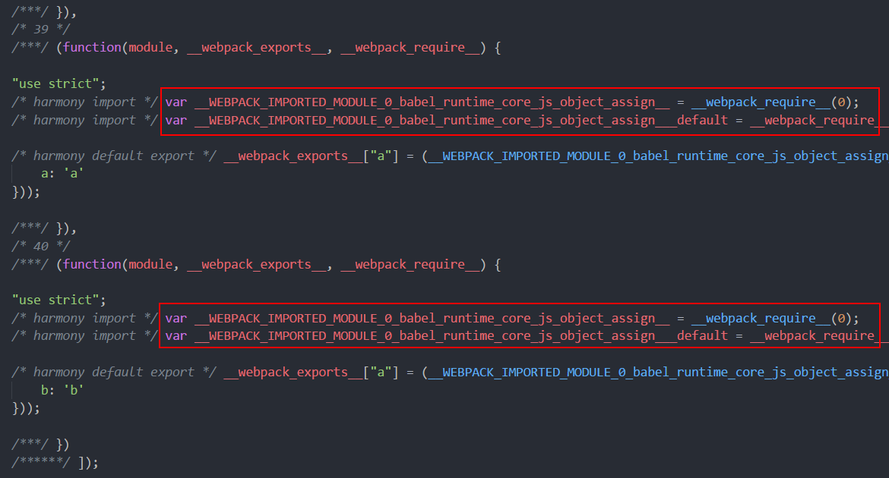
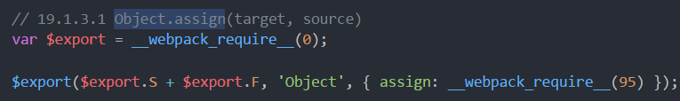

用于比较babel-runtime与babel-polyfill引入垫片的区别：

1. runtime可以自动识别，用到哪个垫片就引入哪个，但是如果多模块，例如a.js和b.js都使用Object.assign方法，打包后这两个模块都会引入Object.assign的垫片。

2.polyfill是全局引入的，只需要引入一次，Object.assign就别全局引入了。

具体何时使用runtime，何时使用polyfill就要看项目大小了。

polyfill是全局引入，一次引入就不需要关系其他，而且所有模块都能通用。如果项目使用了较多的ES6api且项目足够大，模块足够多，建议一次性引入polyfill。

runtime是按需引入的，用到哪个就加载哪个，只在模块内起作用，项目较小，模块较少，可以使用runtime，只有重复引入的冗余量不会超过完整引入polyfill就行。